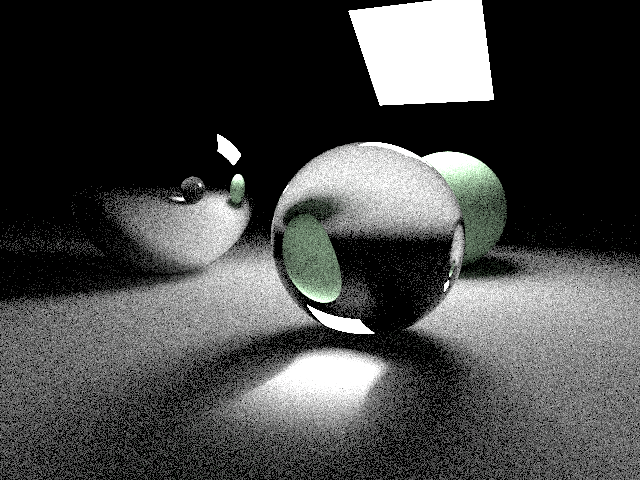
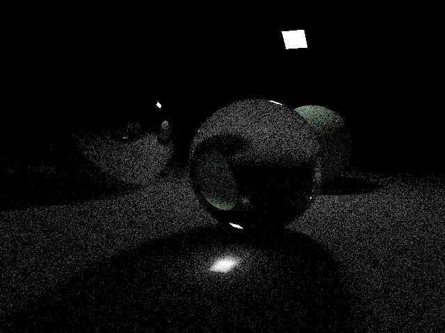
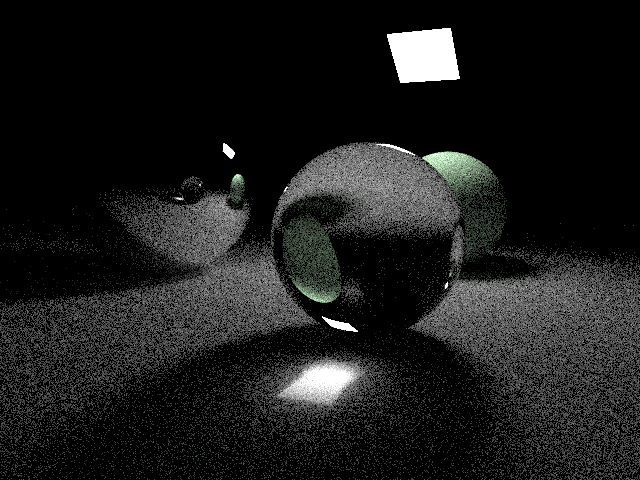
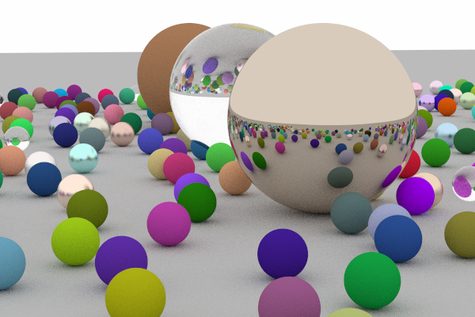
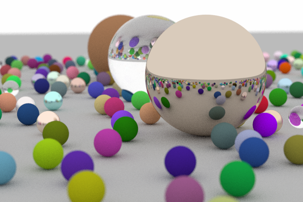
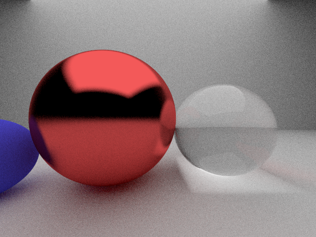
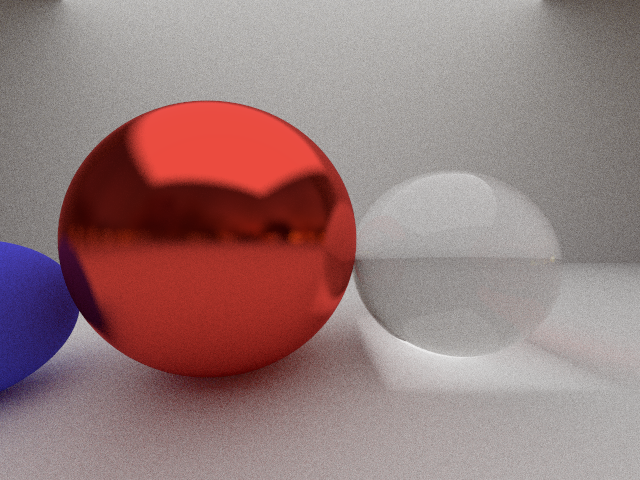
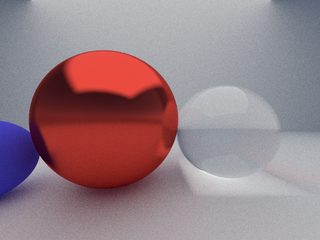

# Task 8: Caustics and Light Source Size

## Observations

> Grande lumière = moins de bruits, petite lumière beaucoup de bruits.
> Une lumière plus grande occupe un plus grand angle solide vue depuis la caméra. Donc plus d'échantillons valides (pas noirs).
> [Wikipedia: Caustique](https://fr.wikipedia.org/wiki/Caustique)
> Les rayons caustiques passent probablement par plusieurs rebonds avant d'atteindre la caméra. Si la source lumineuse est petite, l'ensemble des rayons qui après réfraction/réflexion atteignent la lumière doit être petit, alors les contributions sont rares et de forte intensité = haute variance = bruit.
>
> Moins de lumière crée moins d'informations alors plus de rayon "noirs" sont reçues dans la caméra.

## Visual Comparison

### Grande lumière

### Petite lumière

### Référence

## Analyse

- **Grande lumière** : Plus de rayons atteignent la lumière, donc moins de bruit dans l'image.
- **Petite lumière** : Moins de rayons valides, donc plus de bruit (haute variance).
- **Caustiques** : Les motifs lumineux sont dus à la concentration des rayons après réflexion/réfraction, et sont plus nets avec une source lumineuse plus grande.

# Bonus

## Flou de profondeur
### Référence

### Flou

## Fresnel pour les métaux
### Référence

### Fresnel

## Carte d'environnement
### Référence

### Satara

### Qwantani

