# Rapport devoir 3

## Intersection Rayon Triangle

|     Triangles      |     Cornellbox      |           Cornellbox MIS           |
| :----------------: | :-----------------: | :--------------------------------: |
| 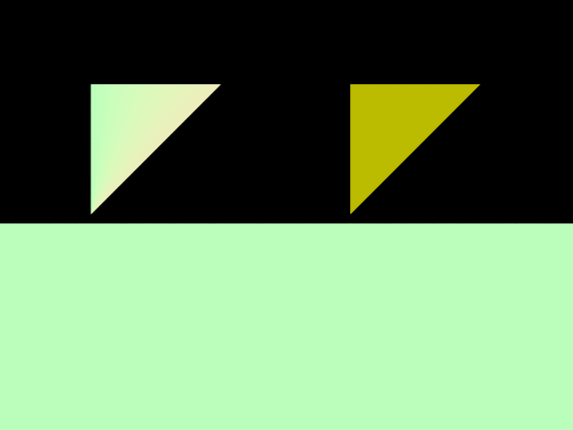 | 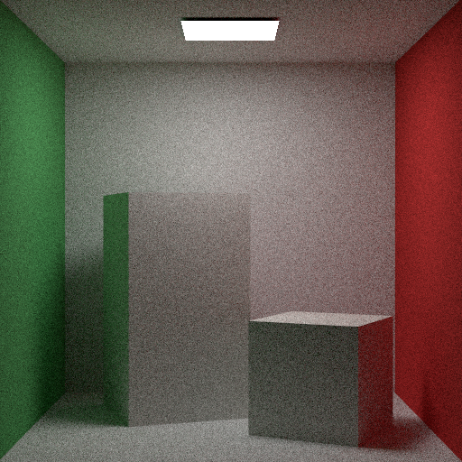 | 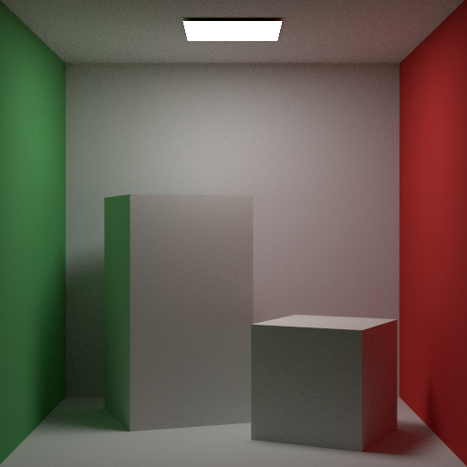 |

## Sampling

|         Uniforme         |                  Ref Uniforme                  |
| :----------------------: | :--------------------------------------------: |
|  |  |
|    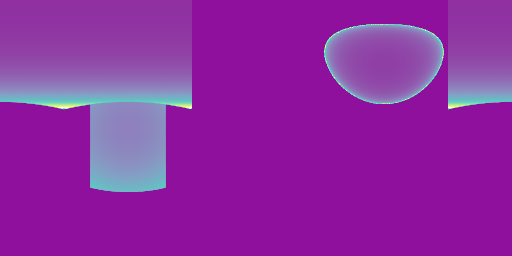    |   |

## Odyssey_mats Direct Strategies

|            BSDF            |            Emitter            |            Naive            |            MIS            |
| :------------------------: | :---------------------------: | :-------------------------: | :-----------------------: |
|  |  |  |  |

## Odyssey_triangle_mats Direct Strategies

|                BSDF                 |                Emitter                 |                Naive                 |                MIS                 |
| :---------------------------------: | :------------------------------------: | :----------------------------------: | :--------------------------------: |
|  |  | 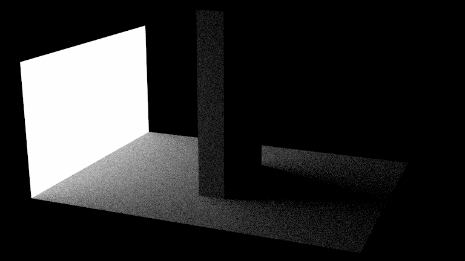 |  |

## All mats Direct Strategies

|         BSDF          |         Emitter          |         Naive          |         MIS          |
| :-------------------: | :----------------------: | :--------------------: | :------------------: |
|  |  |  | 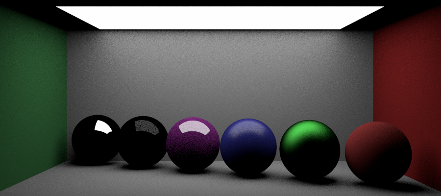 |

## All mats Path vs Path MIS vs Bonus Path MIS

|       Path       |         Path-MIS (20 sec)          |     BONUS Path-MIS (14 sec)     |
| :--------------: | :--------------------------------: | :-----------------------------: |
|  | 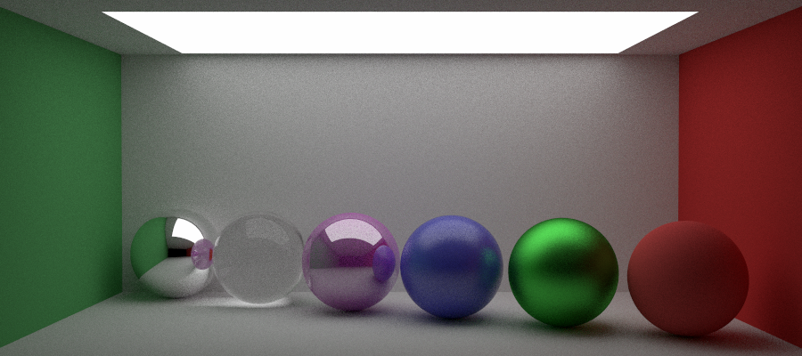 |  |

## Veach Direct MIS

|    Veach N=512     |                  Ref Veach                  |
| :----------------: | :-----------------------------------------: |
|  | 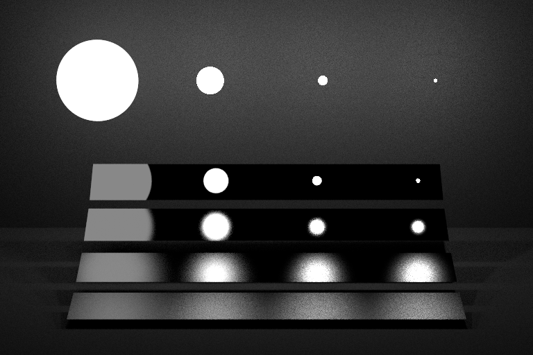 |

## Bonus

### BONUS Path-MIS (14 sec)

### BONUS Amélioration de l'échantillonnage de la sphère

|          Solid Angle           |                  Ref Solid Angle                  |
| :----------------------------: | :-----------------------------------------------: |
|  |  |

#### using Direct Emitter

|        |               Uniforme               |             Solid Angle             |
| :----: | :----------------------------------: | :---------------------------------: |
| small  | 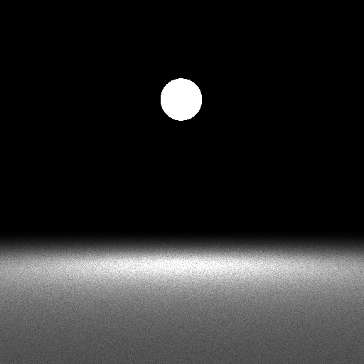 | 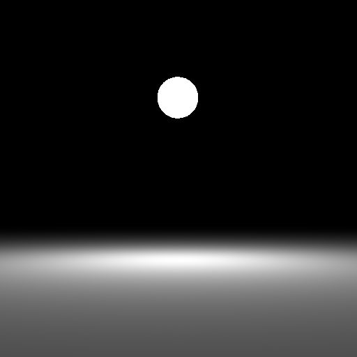 |
| medium |    |  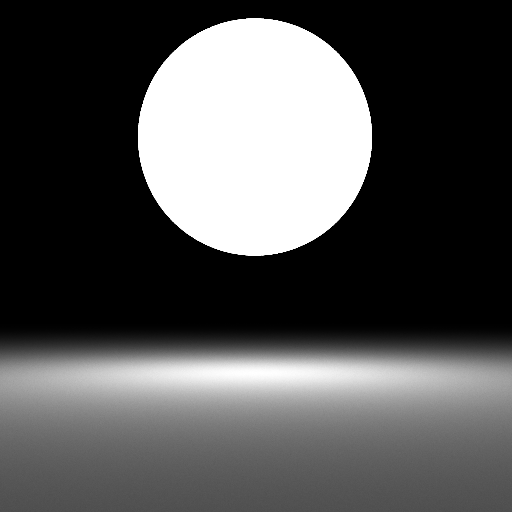  |
|  big   | 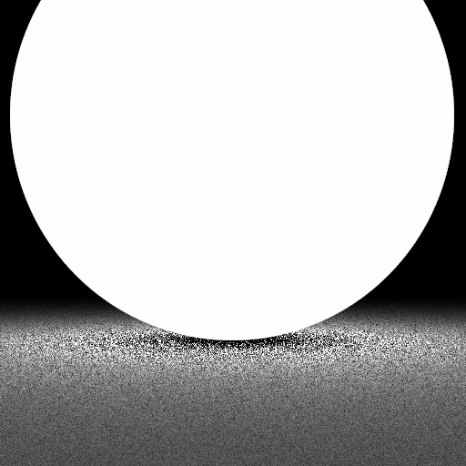 | 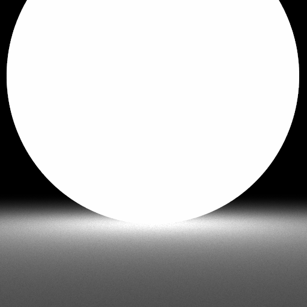 |
