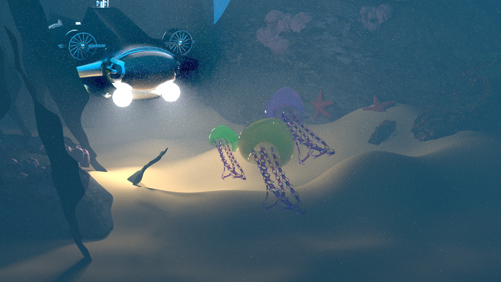
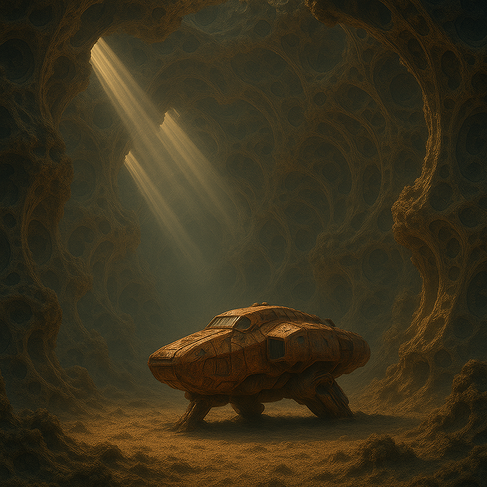
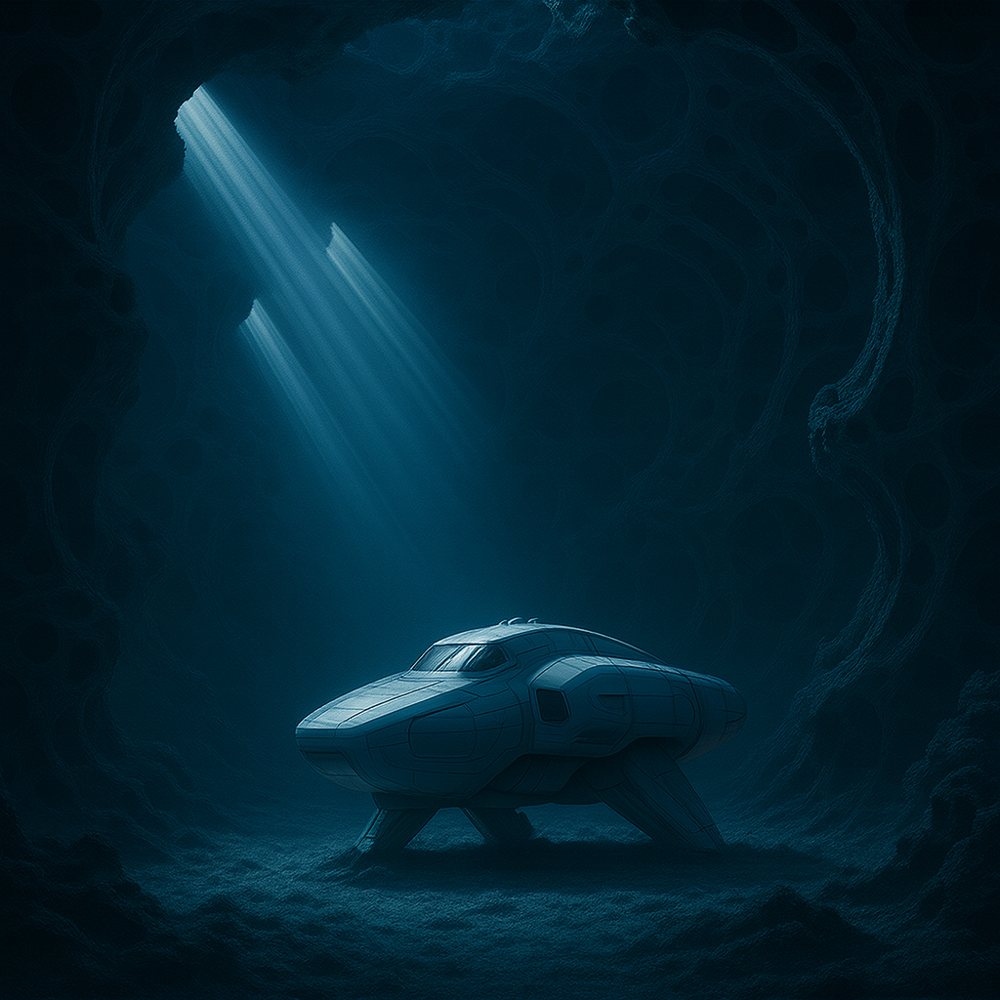
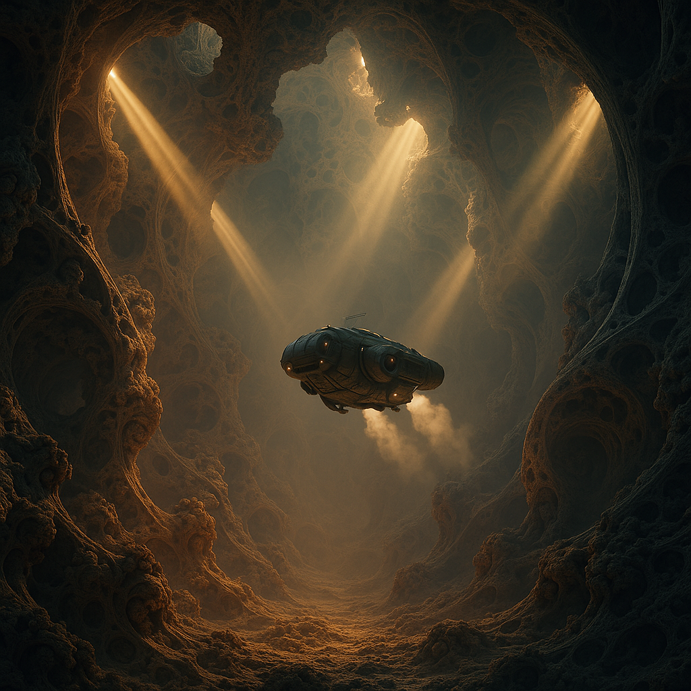

<meta charset="utf-8" emacsmode="-*- markdown -*-">

# Proposition

## Identification

**Nom de l'équipe**: CPPn't

**Membres de l'équipe**:

- Thibaut Baguette
- Wylliam Cantin Charawi

## Image(s) choisies

<!--  -->

| Image 1                                                         | Image 2                                                         |
| --------------------------------------------------------------- | --------------------------------------------------------------- |
|  Credit: Wylliam - GPT |  Credit: Wylliam - GPT |
| Image 3                                                         |                                                                 |
|  Credit: Wylliam - GPT |                                                         |

## Motivations

Les images illustrent un vaisseau abandonné dans une vaste caverne aux parois fractales, éclairé par des rayons de lumière filtrant à travers des ouvertures naturelles. Ce concept visuel a été choisi pour plusieurs raisons, à la fois thématiques, techniques et symboliques.

L’image incarne la fusion entre nature et technologie. Le contraste entre la caverne organique évoquant la lente érosion naturelle et le vaisseau mécanique, symbole d’un passé technologique révolu, crée une tension poétique entre le vivant et l’artificiel, le temps et la mémoire.

Notre intention est de concevoir un batch renderer capable de simuler l’évolution de cette scène au fil du temps.
Les sources lumineuses (soleil, lune, torches, phares, etc.) permettent de visualiser des variations d’éclairage en intensité, angle et teinte, traduisant le cycle jour-nuit ou les saisons.

La progression de la rouille sur la coque du vaisseau évoque le vieillissement des matériaux et le passage du temps.
La caverne fractale suggère une géométrie érodée naturellement, parfaite pour étudier l’évolution de textures et de surfaces à travers des rendus procéduraux successifs.

Ce choix de scènes permet de tenter d'implémenter plusieurs fonctionnalités complexes.
Le générateur fractal permet de produire des cavernes à la topologie complexe, idéales pour tester les effets d’éclairage indirect et d'illumination globale.
Le vaisseau offre une surface réfléchissante et oxydable, permettant d’expérimenter des shaders physiques simulant la corrosion, la patine, ou la dégradation progressive.
Les faisceaux lumineux volumétriques offrent une occasion d’étudier le scattering, la poussière en suspension et la dynamique de l’atmosphère dans un espace clos.

La scène raconte une histoire implicite, celle d’un vaisseau oublié, vestige d’une civilisation disparue, redécouvert dans le silence d’une caverne millénaire.
Cette dimension narrative stimule la curiosité et renforce l’engagement émotionnel du spectateur. Chaque variation d’éclairage ou de texture devient un chapitre visuel du récit.

## Liste des fonctionnalités ciblées

<!--
TODO: Faire la liste des fonctionnalités visées avec les points associés (simple, intermédiaire, difficile). Remplacer "XXX" par le nom de la fonctionnalité. Ajouter des fonctionnalités si nécessaire pour atteindre le nombre de points visés en fonction des difficultés choisies.

### Fonctionnalité "XXX" (8 pts - difficile)

TODO: Motivez le choix de mettre en œuvre cette fonctionnalité par rapport à l'image choisie. Il faut que cette fonctionnalité soit nécessaire pour obtenir l'image voulue. Motivez le choix de la difficulté (simple, intermédiaire, difficile).

### Fonctionnalité "XXX" (4 pts - intermédiaire)

TODO: Motivez le choix de mettre en œuvre cette fonctionnalité par rapport à l'image choisie. Motivez le choix de la difficulté. -->

### Fonctionnalité : Motion Blur (1 pt – simple) @tiwylli

Afin de dynamiser la scène, un effet de flou de mouvement (motion blur) sera intégré pour simuler la chute d’un fragment rocheux depuis le plafond de la caverne.
Cet effet contribue à rompre l’immobilité de la scène et à accentuer l’atmosphère de délabrement progressif.

La complexité de cette fonctionnalité est simple, puisque le motion blur repose sur le calcul de l’interpolation temporelle entre deux images consécutives. L’intensité du flou peut être obtenue en moyennant le rendu courant avec celui de la frame précédente, ou par une intégration temporelle de la position des objets.

### Fonctionnalité : Nouveau type de lumière – Spotlight (1 pt – simple) @SpacewaIker

L’ajout d’une source lumineuse directionnelle de type projecteur (spotlight) est essentiel pour reproduire les puits de lumière naturels visibles dans l’image de référence, qui laissent filtrer des faisceaux lumineux à travers les ouvertures de la caverne.
Ce type de lumière permet de simuler la dispersion directionnelle du soleil et les jeux de contraste volumétriques caractéristiques de la scène.

Cette fonctionnalité est considérée simple, car elle repose sur la définition géométrique d’un cône lumineux avec une atténuation radiale basée sur l’angle entre la direction du faisceau et la normale du point d’échantillonnage.

### Fonctionnalité : Batch Renderer / Animation (1 pt – simple) @tiwylli

Le Batch Renderer permettra de générer automatiquement une séquence d’images représentant l’évolution temporelle de la scène.
Cette fonctionnalité consiste à observer les changements d’éclairage (jour/nuit) et la progression de la rouille sur le vaisseau au fil du temps.

D’un point de vue technique, la mise en œuvre du batch rendering consiste à encoder les paramètres variables de la scène (position et couleur des sources lumineuses, état des matériaux, intensité de la corrosion, etc.) pour chaque image, puis à exécuter un script automatisé qui produit les rendus successifs.

La difficulté est simple, car elle repose principalement sur la gestion séquentielle des rendus et la sauvegarde des images.

### Fonctionnalité Raymarching SDF Fractals (4 - 6 pts - intermédiaire) @tiwylli

Cette fonctionnalité consiste à générer et à rendre la géométrie fractale de la caverne à l’aide d’un algorithme de ray marching sur Signed Distance Fields (SDF).
Plutôt que de s’appuyer sur une géométrie polygonale explicite, la scène utilise une représentation implicite de la surface décrite par une fonction de distance qui pour tout point de l’espace, retourne la distance signée à la surface la plus proche.
Cette approche permet de modéliser efficacement des formes hautement détaillées, auto-similaires et continues, typiques des structures fractales naturelles.

Techniquement, le ray marching consiste à avancer le long du rayon caméra par pas adaptatifs, proportionnels à la distance retournée par la fonction SDF.
Cette méthode est simple à implémenter conceptuellement, mais intermédiaire en difficulté pratique en raison des optimisations nécessaires pour atteindre un rendu stable et performant: gestion du self-shadowing et des artefacts d’intersection, estimation des normales par gradient numérique, adaptation du pas pour éviter les oscillations, intégration avec un modèle d’éclairage physique (Lambertien, Phong, ou Principled BSDF).

Dans le cas spécifique d’une caverne fractale, la fonction SDF est elle-même procédurale et composée d’itérations d’opérations géométriques (pliages, symétries, transformations récursives).
Cela permet d’obtenir une richesse visuelle exceptionnelle à faible coût mémoire, mais augmente la complexité mathématique de l’évaluation du champ de distance.
Le niveau de difficulté est donc évalué comme intermédiaire, car il nécéssite une bonne compréhension du ray marching adaptatif, la mise en œuvre correcte d’une fonction SDF procédurale, et une intégration harmonieuse du shading et des normales dans la boucle de rendu.

### Fonctionnalité : Simulation de la progression de la rouille sur la coque du vaisseau (4 pts – intermédiaire) @tiwylli

Cette fonctionnalité a pour objectif de simuler la progression naturelle de la rouille sur la coque du vaisseau afin de traduire visuellement le passage du temps et l’abandon du navire. Plutôt qu’un simple changement de texture, elle repose sur une évolution continue et localisée des propriétés physiques du matériau métallique. Au fil des frames, le métal initialement propre et brillant se transforme graduellement : son albédo diffus augmente et se teinte de rouge, de brun ou de vert sous l’effet de l’oxydation; sa composante spéculaire perd en intensité et s’élargit, rendant la surface plus mate et moins réfléchissante; enfin, la rugosité de la surface s’accroît, brisant les reflets nets et donnant un aspect granuleux, poudreux, typique d’un métal corrodé.

Cette évolution n’est pas uniforme sur toute la surface : la rouille apparaît d’abord dans les zones les plus vulnérables — bords, arêtes, fissures ou cavités —, là où l’humidité et l’usure s’accumulent. Ce comportement spatialement hétérogène exige l’introduction d’un masque de vulnérabilité ou d’une fonction procédurale qui favorise la dégradation dans ces régions. Sur le plan technique, la simulation s’appuie sur le concept de BRDF dépendante du temps (Time-varying BRDF), où l’apparence d’un matériau est décrite comme une trajectoire continue dans l’espace de ses paramètres physiques plutôt que comme une succession discrète d’états figés. Les composantes diffuse, spéculaire et de rugosité évoluent de manière coordonnée dans le shader afin de maintenir un rendu crédible et naturel à chaque instant.

Cette approche introduit une dimension temporelle explicite dans le pipeline de shading. Le moteur de rendu ne se limite plus à la position, à la normale et à la direction de la lumière : il doit désormais prendre en compte l’état temporel du matériau, transformant ainsi la surface en un système dynamique dont les propriétés optiques évoluent en continu. Pour garantir la fluidité visuelle de cette transformation, les paramètres matériels doivent suivre une loi d’évolution lisse — linéaire, exponentielle ou logistique — qui évite les sauts abrupts entre les images successives.

Évaluée comme une tâche de niveau intermédiaire (4 points), cette fonctionnalité demande une compréhension approfondie du comportement temporel des matériaux, ainsi qu’une mise en œuvre coordonnée de plusieurs composantes physiques dans le shader.

### BSDF Principled (8) @SpacewaIker

Implémentation d'une BSDF "Disney", soit un modèle de BSDF ayant beaucoup de paramètres pour pouvoir réaliser beaucoup de types de matériaux différents. Ceci va aussi faciliter l'utilisation d'"assets" trouvés en ligne, vu qu'il s'agit d'une description de matériau populaire.

## Liste de fonctionnalités de secours

<!-- TODO: Faire une rapide liste de fonctionalité additionelles ("nice to have") qui pourront servir de remplacement aux fonctionalités ciblées. Ces fonctionalités seront utilisée dans la discussion avec le professeur lors de la validation de la proposition pour la compétition. Effectuez une brève description de chaque fonctionnalité et de sa difficulté. -->

### Fonctionnalité : Carte d'environnement avec importance sampling

Amélioration de la fonctionnalité de carte d'environnement implémentée lors des devoirs pour utiliser de l'importance sampling pour traiter la carte d'environnement comme source lumineuse.

### Fonctionnalité : Matériau plastique (1 pt – simple)

Cette fonctionnalité vise à implémenter un matériau de type plastique, destiné à certains éléments secondaires de la scène (outils, débris, équipements).
L’objectif est de contraster la dégradation du métal rouillé du vaisseau avec un matériau plus stable et lisse, dont l’apparence reste pratiquement inchangée au fil du temps. Ce choix est motivé par la volonté de souligner la résilience du plastique face à la corrosion naturelle, renforçant ainsi le thème du passage du temps et de la transformation des matériaux.

Sur le plan technique, ce matériau combine les propriétés d’un shader glossy et diffus selon le modèle de Fresnel pour la réflectance angulaire, en modulant la rugosité à l’aide d’une texture de microdétails (rayures et aspérités).
La mise en œuvre est simple, car elle s’appuie sur des fonctionnalité déjà disponible dans le moteur de rendu, nécessitant seulement un ajustement des paramètres physiques et l’ajout d’une carte de normales pour le relief.

### Fonctionnalité : Matériau émissif (glowing crystals) (1 pt – simple)

Cette fonctionnalité consiste à implémenter un matériau émissif pour simuler des cristaux luminescents disposés au sol de la caverne.
Ces cristaux introduisent une source lumineuse secondaire et contribuent à la composition en rompant l’obscurité ambiante.
Leur lueur douce crée un contraste avec les faisceaux de lumière principaux provenant du plafond et accentue la texture fractale près du sol.
Techniquement, le matériau est basé sur un shader émissif simple, dérivé d’un modèle Lambertien auquel on ajoute une composante d’émission constante indépendante de la lumière incidente.
Une carte de texture peut être utilisée pour faire varier localement la luminosité ou simuler des veines internes au cristal.

Cette fonctionnalité est simple, car elle ne nécessite pas de modèle de réflexion complexe ni d’intégration au calcul de la lumière indirecte. Elle se limite à l’ajout d’un terme d’émission dans le shader existant.

### Fonctionnalité : Effet de vapeur / poussière en suspension (4 pt – intermédiaire)

Cette fonctionnalité vise à ajouter un effet de vapeur, de brume légère ou de poussière en suspension dans l’air, afin de simuler un milieu homogène volumétrique à l’intérieur de la caverne.
Ce type d’effet contribue au réalisme atmosphérique de la scène. Il adoucit les transitions lumineuses, accentue la diffusion des faisceaux (notamment ceux provenant des puits de lumière) et renforce la profondeur visuelle du décor.
La complexité vient principalement du besoin d’un pipeline de volumetric shading distinct du shading de surface, avec accumulation des contributions lumineuses à travers le volume.

### Tâches Bonus des devoirs (6)

#### @SpacewaIker et @tiwylli Devoir 1:

Flou profondeur (1), Fresnel métaux (1), Carte d’environnement (1)

#### @SpacewaIker et @tiwylli Devoir 3:

Amélioration de l’échantillonnage de la sphère (1), Réutilisation de direction échantillonnée (1)

#### @SpacewaIker Devoir 2:

Blinn-phong (1), dielectric avec rugosité (1), sheen (1), metal anisotropique (manque l'orientation fixe) (1)

#### @tiwylli Devoir 2:

Blinn-phong (1), Transparence (1), Translucent (1), Subsurface (1), Oren-Nayar (1), car paint (ggx) (1)

## Répartition du travail

<!-- TODO: Décrirez la répartition du travail dans l'équipe pour la réalisation de la compétition. Cela permet de s'assurer que chaque membre de l'équipe a une tâche à accomplir et que le travail est bien réparti. Cela permet aussi de s'assurer qu'il n'y a pas trop de chevauchement dans les tâches de différentes personnes. -->

Voir les @ sur la liste de fonctionnalités.

<!-- Markdeep:

 -->

### Ressources

https://sketchfab.com/search?q=spaceship&type=models
 
https://openreview.net/forum?id=NZp48P95ij
 
https://iquilezles.org/articles/raymarchingdf/
  Pour aide à la reformulation et correction
https://chatgpt.com
 
https://medium.com/@Sou1gh0st/rust101-building-a-lightweight-software-ray-marching-engine-with-rust-self-referential-000ad4f25feb
 
https://typhomnt.github.io/teaching/ray_tracing/raymarching_intro/
 
https://www.shadertoy.com/view/Xds3zN
